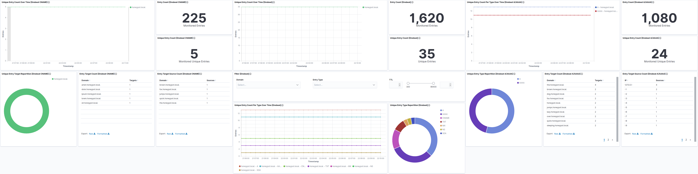
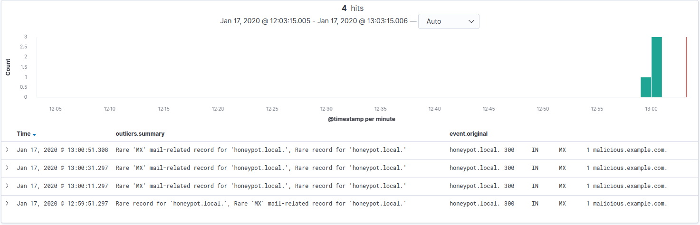

# Dnsbeat

An Elasticsearch Beat to monitor DNS zones through customizable zone transfers.



Dnsbeat ships with default dashboards and can be used to detect DNS anomalies as introduced in the *"[Automated Anomaly-Detection in DNS Zones](https://thiebaut.dev/articles/automated-anomaly-detection-in-dns-records/)"* article.



## Usage

Dnsbeat supports two methods of zone collection which is done either through [zone transfers](https://en.wikipedia.org/wiki/DNS_zone_transfer) or using local zone files.

Using the first approach of zone transfers ensures we get the DNS zone as-is including non-persistent entries and dynamic updates.
This approach is most suitable when the name servers are highly customisable such as with the Linux BIND service.

Alternatively, in cases where a zone transfer (AXFR request) is not supported by the provider ([Azure](https://docs.microsoft.com/en-us/azure/dns/dns-import-export), AWS, ...), dnsbeat can parse a zone file given its path.
This latter approach empowers advanced users with the ability to use dnsbeat while retrieve the zone file through provider-specific scripting.

### Zone Transfers

To configure dnsbeat for zone transfer collection, configure your name server accordingly.
In the case of Linux BIND this means at least configuring the `allow-transfer` parameter and, in production environments, [setting up TSIG](https://www.cyberciti.biz/faq/unix-linux-bind-named-configuring-tsig/).
Do note that **zone transfers occur on port `53/tcp`** per [RFC 5936](https://tools.ietf.org/html/rfc5936) as opposed to the usual port `53/udp`.

Once done, you can configure dnsbeat using the following example.

```yaml
dnsbeat:
  zones:
    - fqdn: "minimal.example.com."
      nameservers:
        - hostname: 192.168.0.100:53
      period: 5m
    - fqdn: "full.example.com."
      bind: 192.168.0.1
      nameservers:
        - hostname: 192.168.0.100:53
          tsig:
            secret: "Base64Secret=="
            algorithm: HmacSHA512
            fudge: 5m
        - hostname: 192.168.0.101:53
      timeouts:
        dial: 2s
        read: 5s
      period: 5m
```

The above configuration monitors two zones (`minimal.example.com.` and `full.example.com.`).
The first zone (`minimal.example.com.`) is a minimal example while the second zone (`full.example.com.`) overrides timeouts, has TSIG enabled for the primary name server, a fail-over server as well as a specific out-bound IP.


### Local Zone Files

In cases where zone transfers are impossible, dnsbeat can be configured to read a zone file stored locally.

```yaml
dnsbeat:
  zones:
    - fqdn: "file.example.com."
      zonefile: "/path/to/my_zone.txt"
      period: 5m
```

### Multiple Configurations

Do note that the `dnsbeat.zones` configuration key is an array, allowing you to configure both zone transfers (TSIG-enabled or not) and local zone files.
Furthermore, although I see no use case, you can define both name servers as well as one fallback file as outlined in the following complete example.

```yaml
dnsbeat:
  zones:
    - fqdn: "complex.example.com."
      bind: 192.168.0.1
      nameservers:
        - hostname: 192.168.0.100:53
          tsig:
            secret: "Base64Secret=="
            algorithm: HmacSHA512
            fudge: 5m
        - hostname: 192.168.0.101:53
      zonefile: "/path/to/my_zone.txt"
      timeouts:
        dial: 2s
        read: 5s
      period: 5m
```

## Development

Ensure that this folder is at the following location:
`${GOPATH}/src/github.com/0xThiebaut/dnsbeat`

### Getting Started with Dnsbeat

### Requirements

* [Golang](https://golang.org/dl/) 1.7

#### Init Project
To get running with Dnsbeat and also install the
dependencies, run the following command:

```
make setup
```

It will create a clean git history for each major step. Note that you can always rewrite the history if you wish before pushing your changes.

To push Dnsbeat in the git repository, run the following commands:

```
git remote set-url origin https://github.com/0xThiebaut/dnsbeat
git push origin master
```

For further development, check out the [beat developer guide](https://www.elastic.co/guide/en/beats/libbeat/current/new-beat.html).

#### Build

To build the binary for Dnsbeat run the command below. This will generate a binary
in the same directory with the name dnsbeat.

```
make
```


#### Run

To run Dnsbeat with debugging output enabled, run:

```
./dnsbeat -c dnsbeat.yml -e -d "*"
```


#### Test

To test Dnsbeat, run the following command:

```
make testsuite
```

alternatively:
```
make unit-tests
make system-tests
make integration-tests
make coverage-report
```

The test coverage is reported in the folder `./build/coverage/`

#### Update

Each beat has a template for the mapping in elasticsearch and a documentation for the fields
which is automatically generated based on `fields.yml` by running the following command.

```
make update
```


#### Cleanup

To clean  Dnsbeat source code, run the following command:

```
make fmt
```

To clean up the build directory and generated artifacts, run:

```
make clean
```


#### Clone

To clone Dnsbeat from the git repository, run the following commands:

```
mkdir -p ${GOPATH}/src/github.com/0xThiebaut/dnsbeat
git clone https://github.com/0xThiebaut/dnsbeat ${GOPATH}/src/github.com/0xThiebaut/dnsbeat
```


For further development, check out the [beat developer guide](https://www.elastic.co/guide/en/beats/libbeat/current/new-beat.html).


### Packaging

The beat frameworks provides tools to crosscompile and package your beat for different platforms. This requires [docker](https://www.docker.com/) and vendoring as described above. To build packages of your beat, run the following command:

```
make release
```

This will fetch and create all images required for the build process. The whole process to finish can take several minutes.
